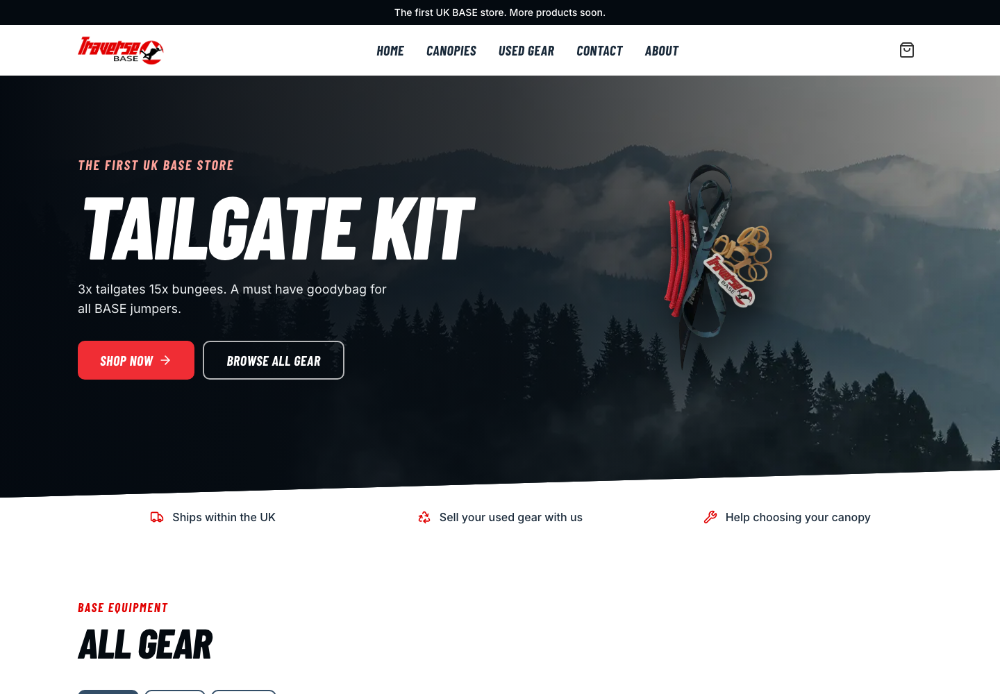
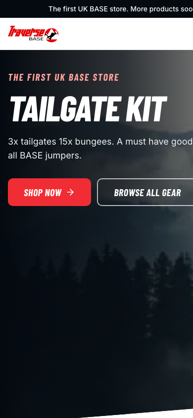
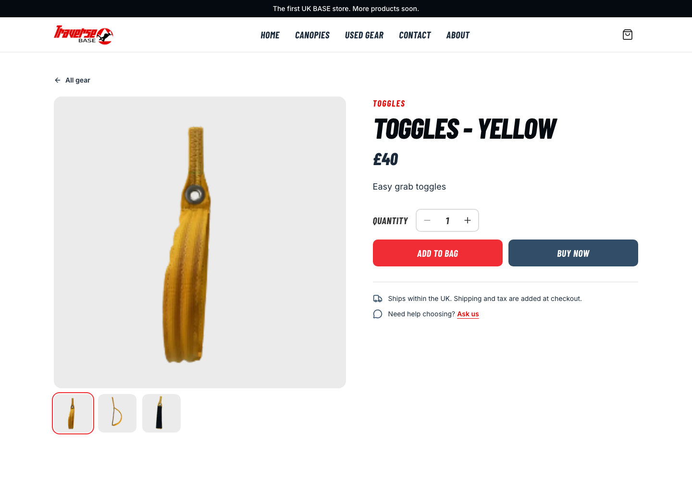

# Traverse Base

Online store for [Traverse Base](https://www.traversebase.co.uk/), the first UK BASE jumping gear shop.
Products and the hero banner are managed in Sanity. Payments are handled by Stripe Checkout.



<p>
  
  
</p>

## Stack

| | |
|---|---|
| Framework | Next.js 16 (App Router, Turbopack), React 19, TypeScript |
| Styling | Tailwind CSS 4, shadcn/ui (Radix), Barlow Condensed + Inter via `next/font` |
| Content | Sanity 6 (embedded Studio at `/studio`), `next-sanity` |
| Payments | Stripe Checkout (`stripe` 23) |
| State | zustand (persisted cart) |
| Validation | zod |
| Tests | Vitest (unit), Playwright (browser) |
| Hosting | Vercel (Node 24) |

## Getting started

Requires Node 22.12 or newer (Vercel runs 24.x).

```bash
npm install
npm run dev        # http://localhost:3000
```

Sanity only answers browsers from allowed origins. Add `http://localhost:3000` under
**API → CORS origins** in the Sanity project settings if you ever fetch from the browser again.
Server-side fetching (what the app does now) is not affected.

### Environment variables

| Variable | Required | Purpose |
|---|---|---|
| `STRIPE_SECRET_KEY` | for checkout | Creates Checkout Sessions and confirms paid orders on `/success` |
| `STRIPE_SHIPPING_RATE_ID` | no | Stripe shipping rate (`shr_...`). Falls back to the original rate if unset |
| `NEXT_PUBLIC_SANITY_PROJECT_ID` | no | Defaults to the production project |
| `NEXT_PUBLIC_SANITY_DATASET` | no | Defaults to `production` |
| `NEXT_PUBLIC_SANITY_API_VERSION` | no | Defaults to a pinned date |

There is no Sanity token: the dataset is public-read and the app only reads. Never prefix a secret with `NEXT_PUBLIC_`.

## Scripts

```bash
npm run dev         # development server
npm run build       # production build
npm run start       # serve the production build
npm run lint        # ESLint
npm run typecheck   # tsc --noEmit
npm test            # unit tests (Vitest)
npm run test:e2e    # browser tests (Playwright), needs a production build first
```

### Testing

- **Unit** (`tests/unit`): cart store rules, price formatting, and the checkout route (validation, prices read
  from Sanity rather than the browser, sold-out handling, pence rounding, Stripe parameters).
- **Browser** (`tests/e2e`): browse, filter, add to bag, quantity changes, persistence across reloads,
  the checkout request payload and error handling, navigation on desktop and mobile. They use the Chrome installed
  on your machine and run against live Sanity content.

```bash
npm run build && npm run test:e2e
# or against a deployed site:
BASE_URL=https://your-preview.vercel.app npm run test:e2e
```

Tests that need a Stripe key are skipped when `STRIPE_SECRET_KEY` is not set.

## How it works

- **Pages** (`app/(shop)`) are Server Components that read from Sanity (`lib/sanity/queries.ts`) and revalidate
  every 60 seconds. Product pages are generated ahead of time from the product slugs.
- **The Studio** (`app/studio`) sits outside the shop layout so it gets its own full-screen UI.
- **Cart** (`lib/cart-store.ts`) is a persisted zustand store holding a snapshot of each item. Totals are derived,
  and quantities are limited to 1 to 20.
- **Checkout** (`app/api/checkout/route.ts`) accepts only `{ id, quantity }` per item. Names, prices and stock
  come from Sanity at that moment, so a tampered cart cannot change what is charged. Sold-out and missing items
  are refused.
- **Order confirmation** (`app/(shop)/success`) asks Stripe whether the Checkout Session is paid before it
  confirms anything or clears the cart.
- **Design tokens** live in `app/globals.css`: brand red `#f02d34`, slate ink `#324d67`, surface greys, and
  the semantic variables shadcn/ui reads. Use `brand-*` and `ink-*` utilities rather than hex values.

## Deployment

Pushes to `main` deploy to production on Vercel. Other branches get preview deployments.
The Vercel project must use Node 22 or newer (the `engines` field pins `24.x`).

Not built yet: a Stripe webhook and an orders database (order history, stock decrements), and email from the
contact page. See `UPGRADE_PLAN.md` for the upgrade history and ideas.

## Contact

traversebase@gmail.com
