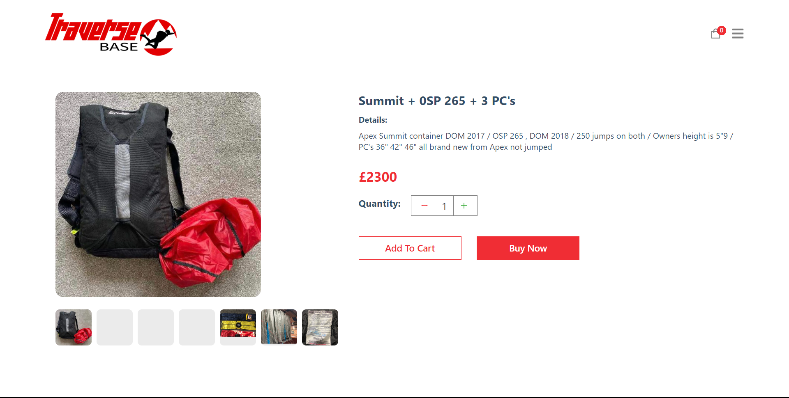

# UK Cliff Jumping Map

[Live Site](https://www.traversebase.co.uk/)

## TABLE OF CONTENT

- [Project Overview](#project-overview)
- [User Experience (UX)](#user-experience-ux)
  - [Client Goals](#client-goals)
  - [Design](#design)
    - [Colours Used](#colours-used)
    - [Typography](#typography)
- [Actual Features](#actual-features)
- [Technologies Used](#technologies-used)
  - [Languages, Frameworks, Libraries \& Programs Used](#languages-frameworks-libraries--programs-used)
  - [Testing and Accesibility](#testing-and-accesibility)
    - [W3C CSS Validation Result](#w3c-css-validation-result)
    - [Manual testing](#manual-testing)
- [Deployment](#deployment)
  - [Forking a Repository](#forking-a-repository)
  - [Cloning a Repository](#cloning-a-repository)
- [Contact](#contact)

## Project Overview

 This application is an e-commerce application aimed to be simple and easy to navigate. The store aims to bring manufacturing to the UK to eradicate import costs. 

## User Experience (UX)

Users can explore the site from the Home page where they are greeted with a banner of a popular product. After scrolling down all the unfiltered products are revealed in a easy to view grid like fashion. 

#### Client Goals

- To provide an easy to navigate E-commerce store
- Include branding of the site via the header logo
- Provide a contact and about page for business transparency
- Allow a secure payment method that users are familiar with
- Provide a backend to make it simple to add new products from different catorgories
- The site must be responsive to different devices
- A 'cart' area to allow the user to keep track of items added to the cart
  
## Design

### Colours used

- The chosen colors were picked to provide a visually appealing and coherent aesthetic throughout the website. The primary color used is #f02d34, which is a vibrant red tone used for important elements such as buttons and highlights. This color choice adds energy and attracts attention to key areas of the interface. 

- Secondary colors include various shades of gray (#324d67 and #ebebeb) for text and background elements, providing contrast and ensuring readability. These neutral tones complement the primary red color and create a balanced visual hierarchy.

### Typography

- **Primary Font:** The primary font used throughout the website is a system font stack that prioritizes readability and compatibility across different devices and platforms. The font stack includes popular sans-serif typefaces such as -apple-system, BlinkMacSystemFont, Segoe UI, Roboto, and more.

- **Secondary Font:** Additionally, the website utilizes a custom font named 'hypik' for specific branding or decorative purposes. This font adds personality and uniqueness to certain headings or elements, enhancing the overall visual identity of the website.
``

## Actual Features

- **Home page banner:** The banner provides a nice introduction to the website and a clear image of the kind of product a customer can expect

  

- **Home page products:** A grid view of products for the customer to browse if that is there preferred method of shopping

  

- **Product page:** Provides a deeper insight into each and every product, including images and a discription for a more informed purchase decision and immersive experience.

  

- **Navigation menu:** Works well on desktop and mobile devices, it is clear and easy to use.

  

- **Cart:** A nice view of everything added to the cart, the icons used are universal and well known.

  

## Technologies Used

### Languages, Frameworks, Libraries & Programs Used

- HTML5: to create the structure and content of the quiz.
- CSS contributes to the overall look and feel of the quiz, making it visually engaging for users.
- [TypeScript](https://www.typescriptlang.org/): A statically-typed superset of JavaScript, enhancing code quality and maintainability.
- [Sanity](https://www.sanity.io/): A backend platform used for product data storage and easy product management.
- [Next.js](https://nextjs.org/): A React framework for building server-side rendered and statically generated applications.
- [React](https://reactjs.org/): A JavaScript library for building user interfaces.
- [Tailwind CSS](https://tailwindcss.com/): A utility-first CSS framework for quickly building custom designs.
- [Stripe](https://stripe.com/): A payment processing platform used for handling transactions securely.
- [React Icons](https://react-icons.github.io/react-icons/): A collection of popular icons as React components.
  - [Github](https://github.com/) | Utilized as a repository for storing the project.
  - [Font Awesome](https://fontawesome.com/icons) | Used for the inclusion of icons within the project.
  - [Am I Responsive?](https://ui.dev/amiresponsive?) | Used to present the website's responsiveness across various devices.
  - [W3C CSS Validator](https://jigsaw.w3.org/css-validator/) | used to check the validity of my CSS code.
  

## Testing and Accesibility
  
The webapp was tested on different web browsers such as [Google Chrome](https://www.google.com/chrome/),[Microsoft edge](https://www.microsoft.com/en-us/edge?form=MA13L0)

#### W3C CSS Validation Result

- The CSS validation process revealed that i had one incorrect use of margin-top where i had mistakenly included two values.

### Manual testing

- The Navbar was tested along with all navigation links
- The product links and banner were tested
- The product page buttons were tested
- Cart responds as expected 
- Stripe payments was tested in the test mode and also the first live purchase was a test
- Different category pages behave as expected
- Adding products via Sanity works correctly

### Deployment

1. **Create Vercel Account**: Sign up for Vercel and install the Vercel CLI globally.

2. **Link GitHub Repository**: Connect your GitHub repository to Vercel.

3. **Install Vercel GitHub App**: Install the Vercel GitHub App on your GitHub repository.

4. **Configure Deployment Settings**: Set up deployment settings in the Vercel dashboard.

5. **Deploy Project**: Vercel automatically deploys changes pushed to the linked GitHub repository's specified branch.

6. **Monitor Deployment**: Track deployment status and logs in the Vercel dashboard.

7. **Access Deployed Project**: Use the provided deployment URL to access your deployed project.

By following these steps, you can swiftly deploy your project from GitHub to Vercel, enabling seamless continuous deployment and hosting.

#### Forking a Repository

1.Log in to GitHub and locate the repository that you want to fork.

2.Click on the 'Fork' button found on the top right of the repository page.

3.Select the destination where you want to fork the repository.

4.After forking is complete, you'll be redirected to your forked repository.

#### Cloning a Repository

1.On the GitHub repository page, click on the "Code" button and copy the repository URL provided.

2.Open your terminal and navigate to the directory where you want to clone the repository.

3.Use the 'git clone' command followed by the repository URL you copied and press 'Enter'

### Code

- [W3Schools](https://www.w3schools.com/)
  
- Youtube tutorials were used.These tutorials were instrumental in helping me understand how to effectively use Sanity in the development.

## Contact
For any inquiries or feedback regarding the UK BASE Jumping Map application, please contact the project maintainer at jakelewisorton@gmail.com